# Wordagam

A fun & interactive word game. Check out the screenshots and the gameplay video.

## Download & Play

Download the latest JAR [here](https://github.com/gravetii/wordagam/releases/download/v1.6/wordagam-1.6.jar) to play the game.

## Prerequisites

Wordagam requires Java 8 to be installed to run the JAR.

## Building the project

This is a maven project. In the root folder of the project, run `mvn clean compile assembly:single` which outputs the JAR file in the `target/` folder.

## Game play video

## Screenshots

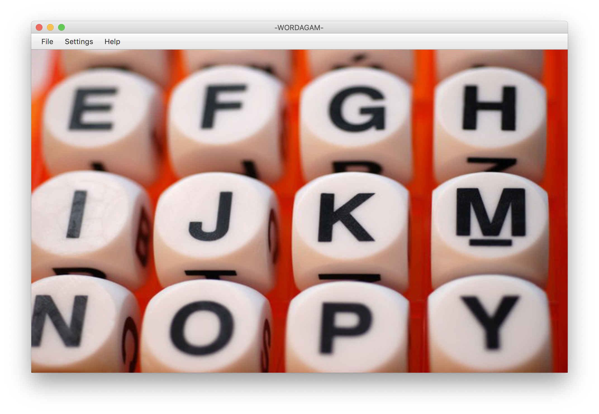
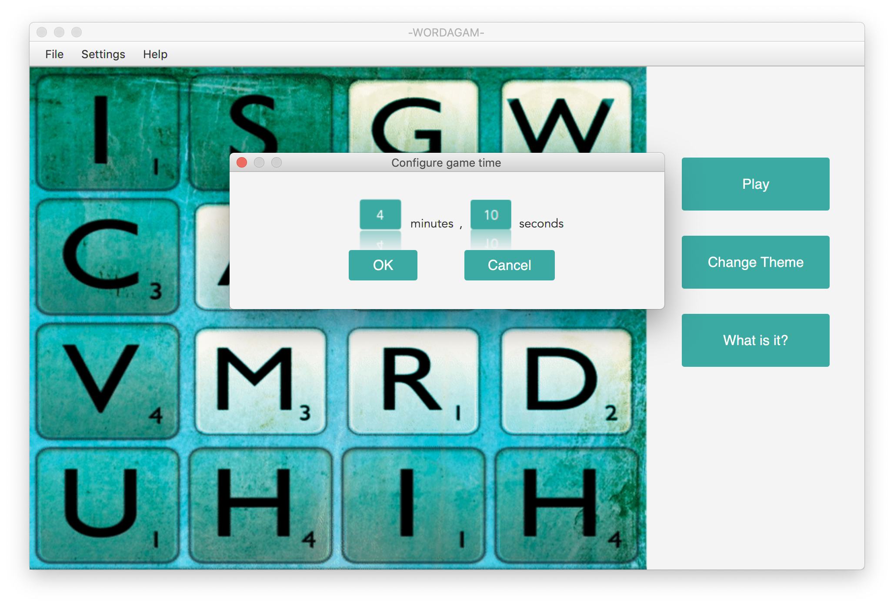
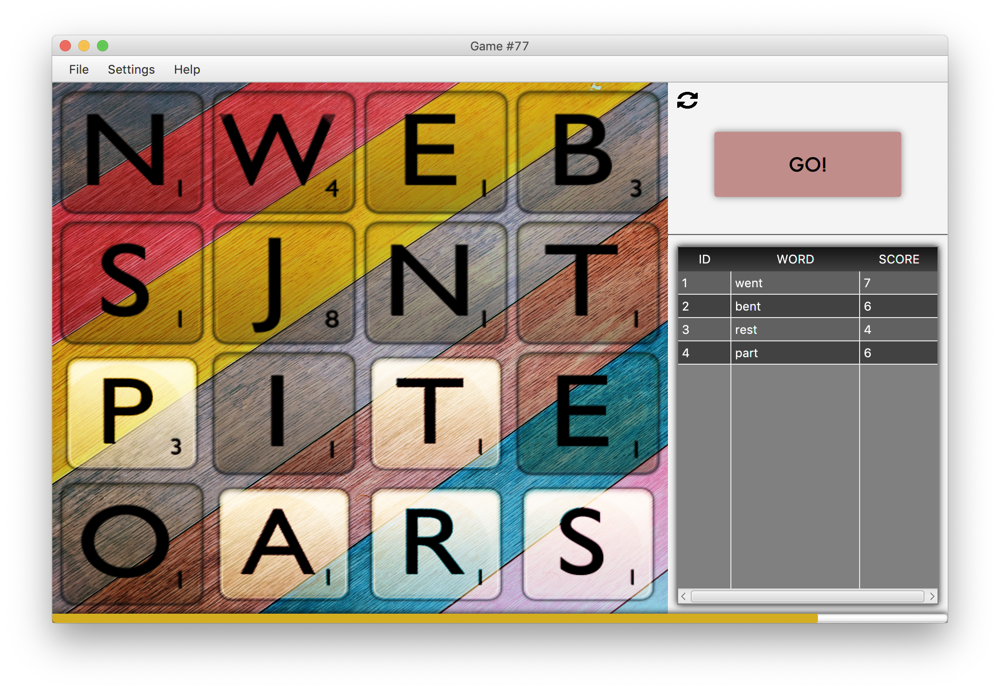

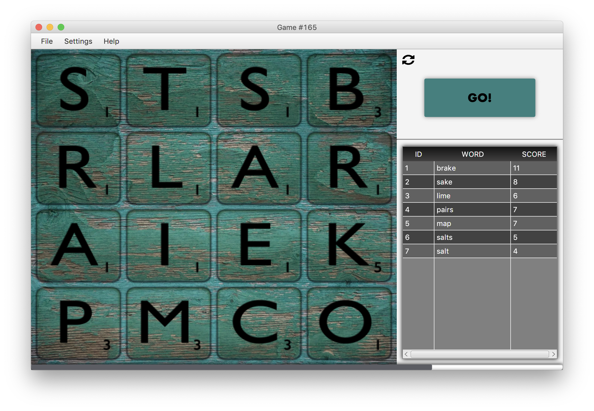
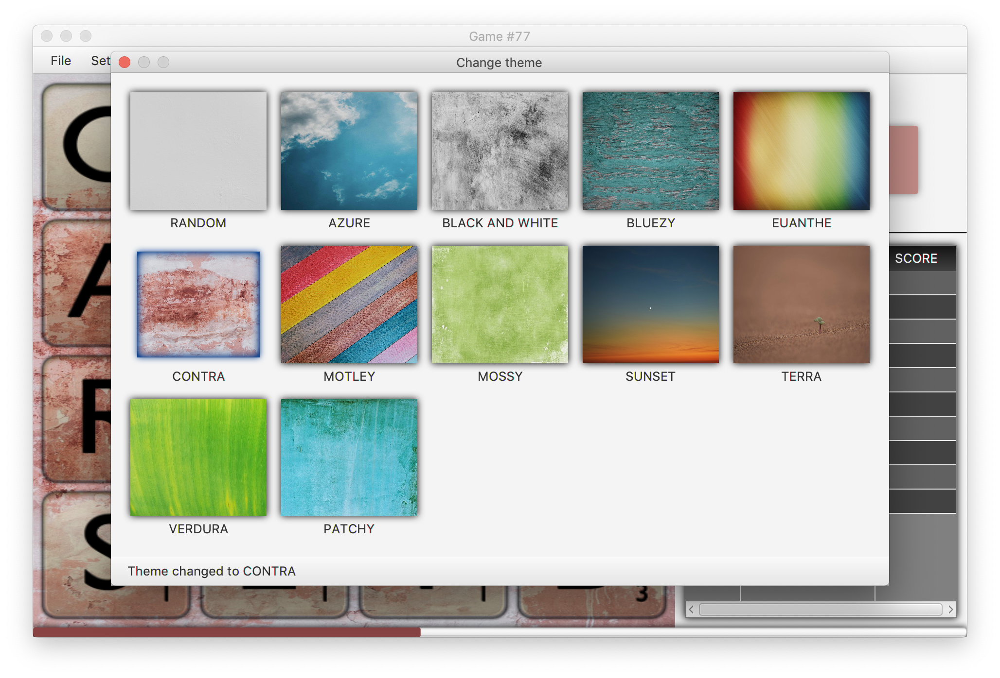
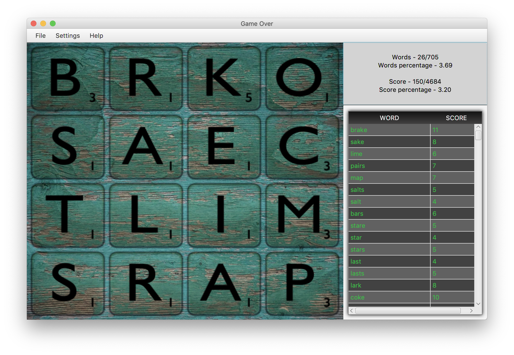
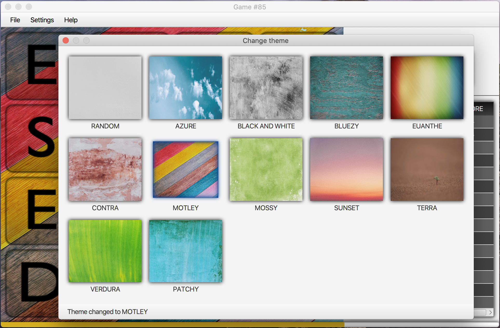
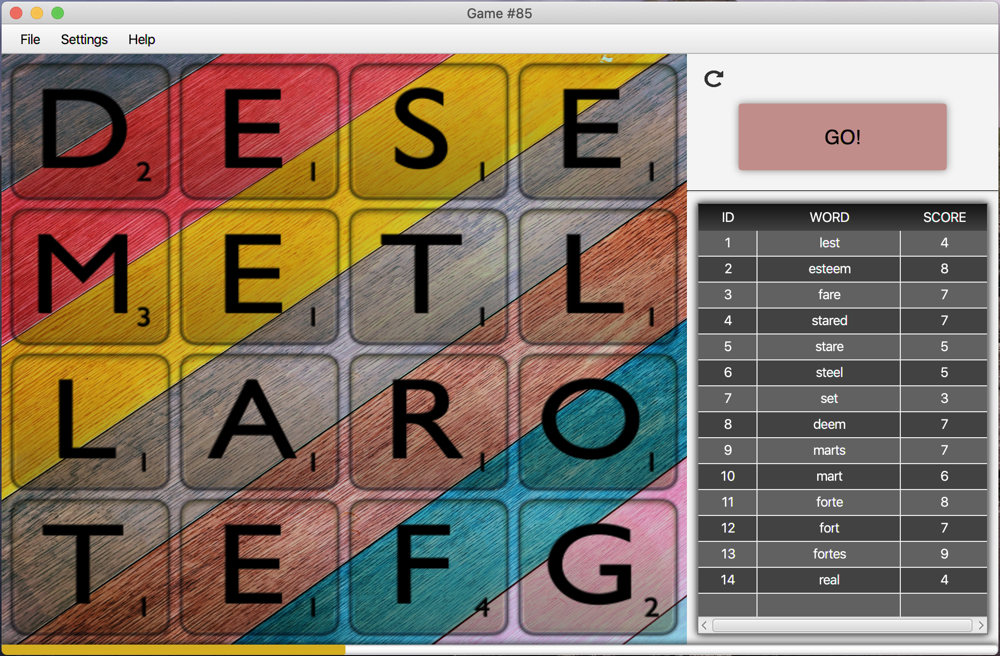
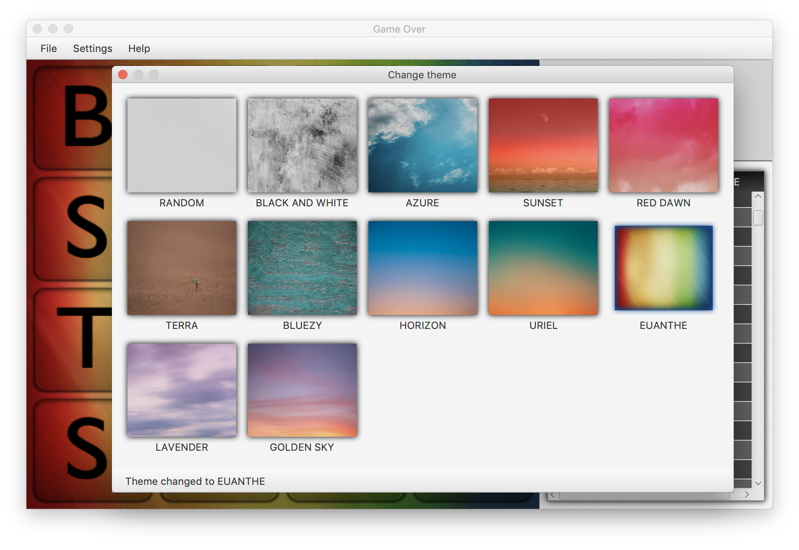
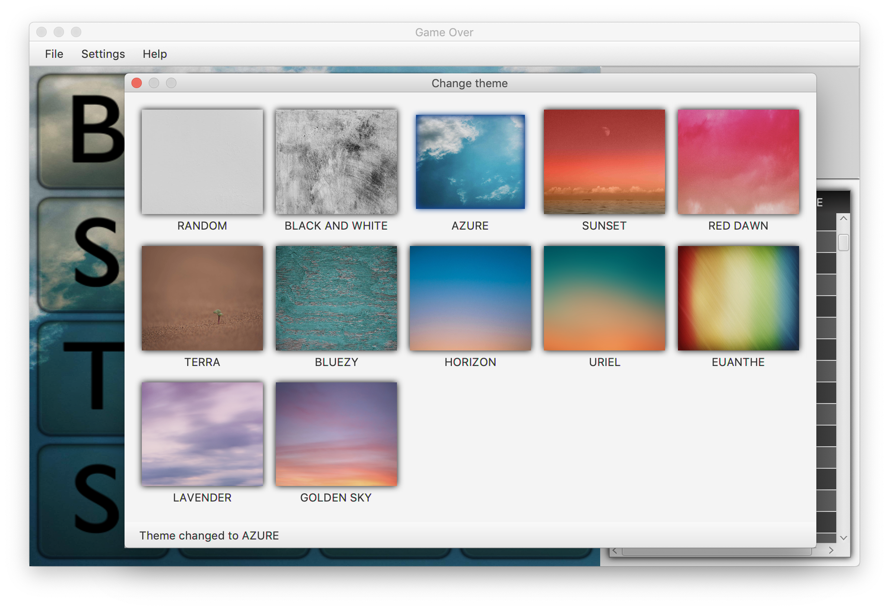
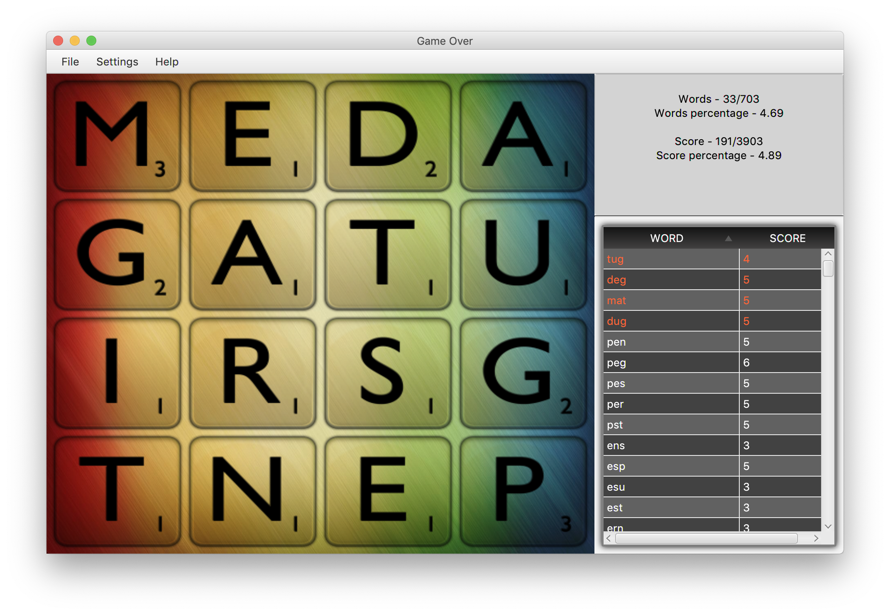

---

Theme images picked from <a href="https://unsplash.com" target="_blank">Unsplash</a>.

