# Wordagam

<p align="center">
<a href="https://opensource.org/licenses/MIT"></a>
<a href="https://github.com/gravetii/wordagam/releases/latest"></a>
<a href="https://github.com/gravetii/wordagam/releases"></a>
<a href="https://saythanks.io/to/gravetii"></a>
</p>

A fun & interactive word game. Check out the screenshots and the gameplay video.

## Download & Play

Download the latest artefacts [here](https://github.com/gravetii/wordagam/releases/tag/v3.0). You can download the MacOS artifact [here](https://github.com/gravetii/wordagam/releases/download/v3.0/wordagam-mac.zip), but artefacts for other platforms can also be built as easily. Check the `Building from source` section below.

After downloading the zip file, extract it and run `wordagam` -  

```
./wordagam-mac/bin/wordagam
```

You can download an older version of the game as a JAR file [here](https://github.com/gravetii/wordagam/releases/download/v1.6/wordagam-1.6.jar).

## Prerequisites

The latest version of the artifact doesn't require a pre-existing Java runtime. This is possible because the project makes use of `jlink` to create a custom runtime image which comes bundled with the Java runtime.

## Building from source

The project is built as a modular Java application using gradle. You can build the project and create a custom runtime image for your platform using `jlink`. Run this in the root folder of the project - 
```
./gradlew clean jlink
```

Running this command creates the runtime image which you can run to play the game - 
```
build/image/bin/wordagam
```

## Game play video

<a href="http://www.youtube.com/watch?feature=player_embedded&v=EuWyjQGn0H0
"></a>

## Screenshots

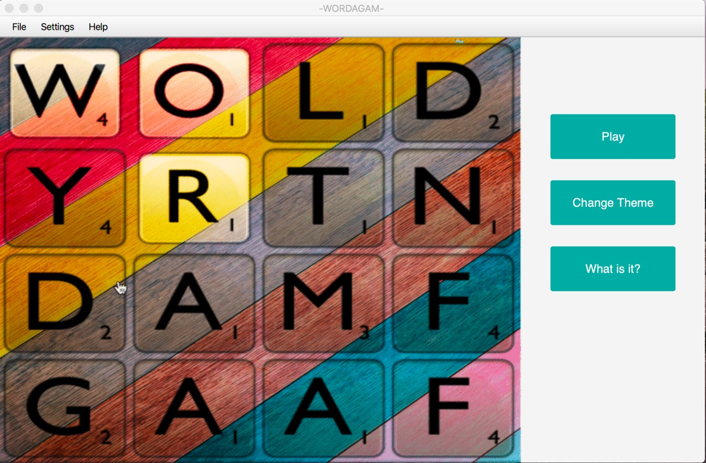
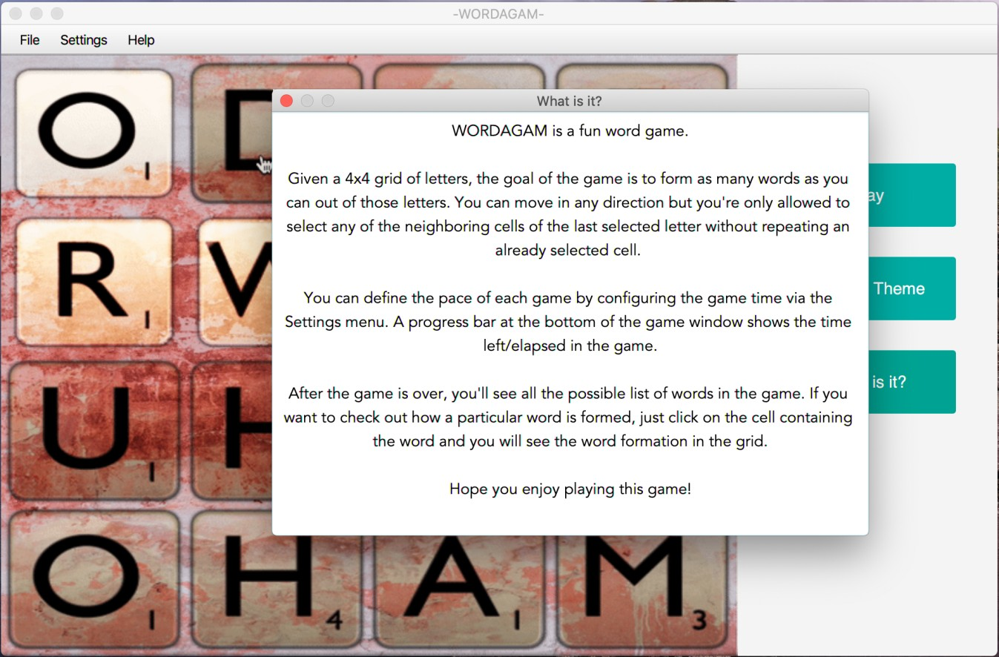
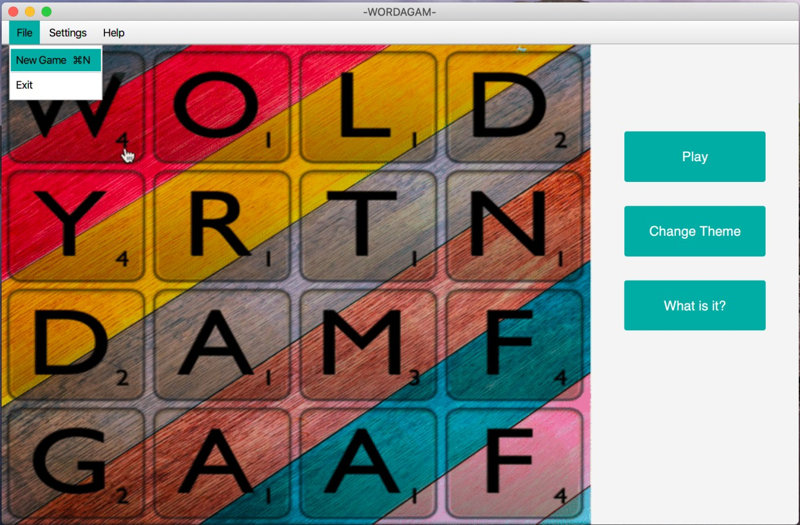

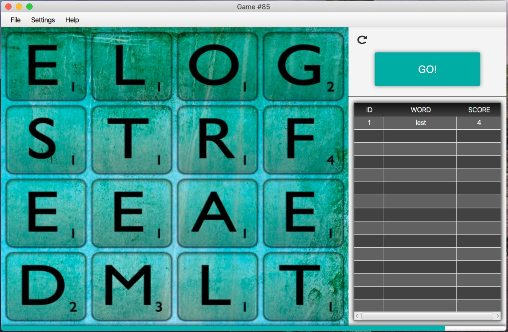
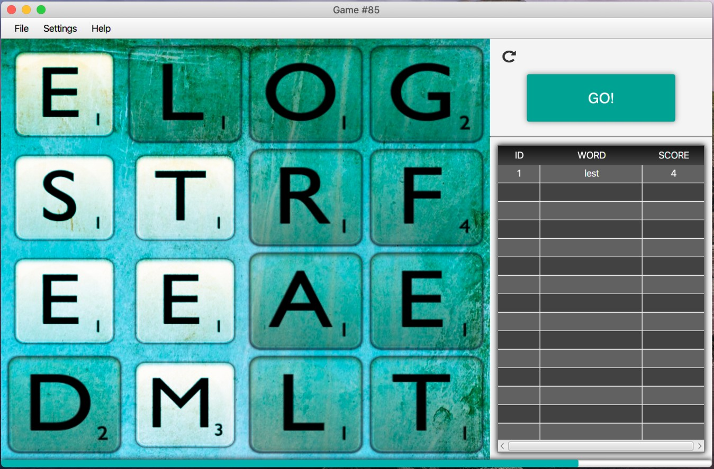
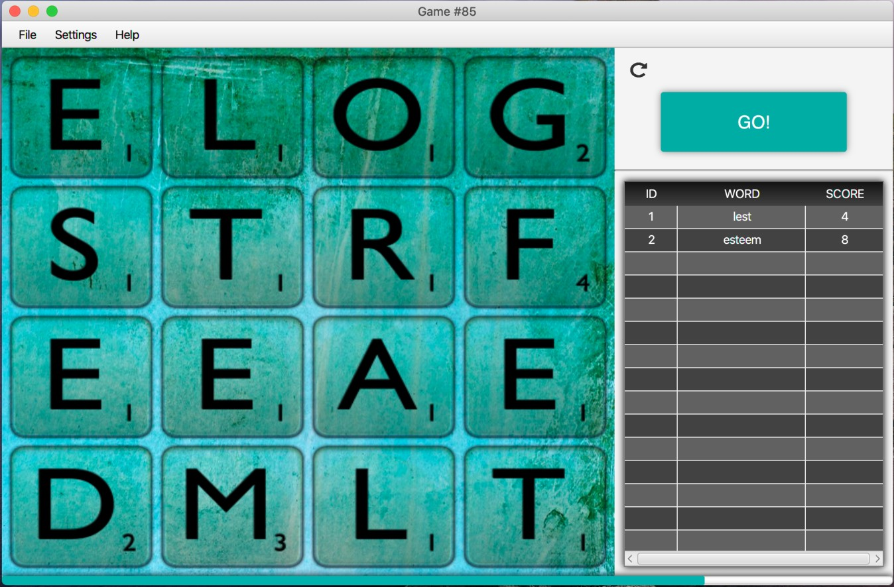
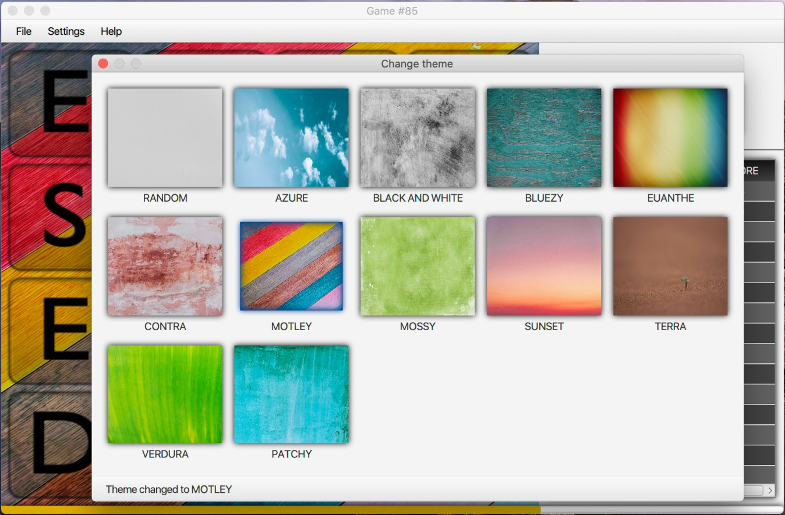
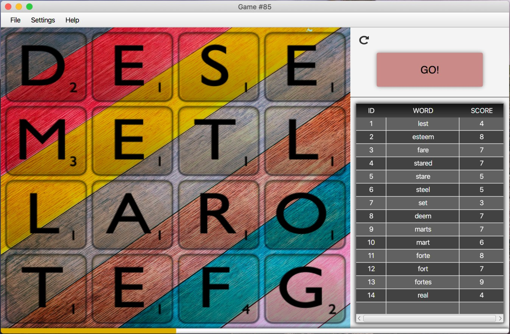
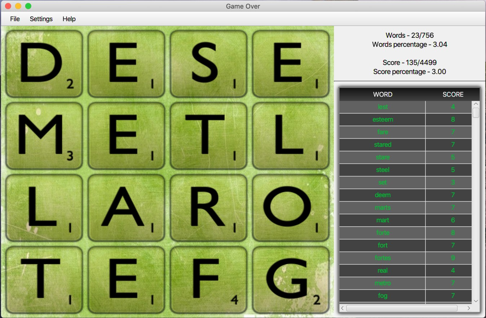
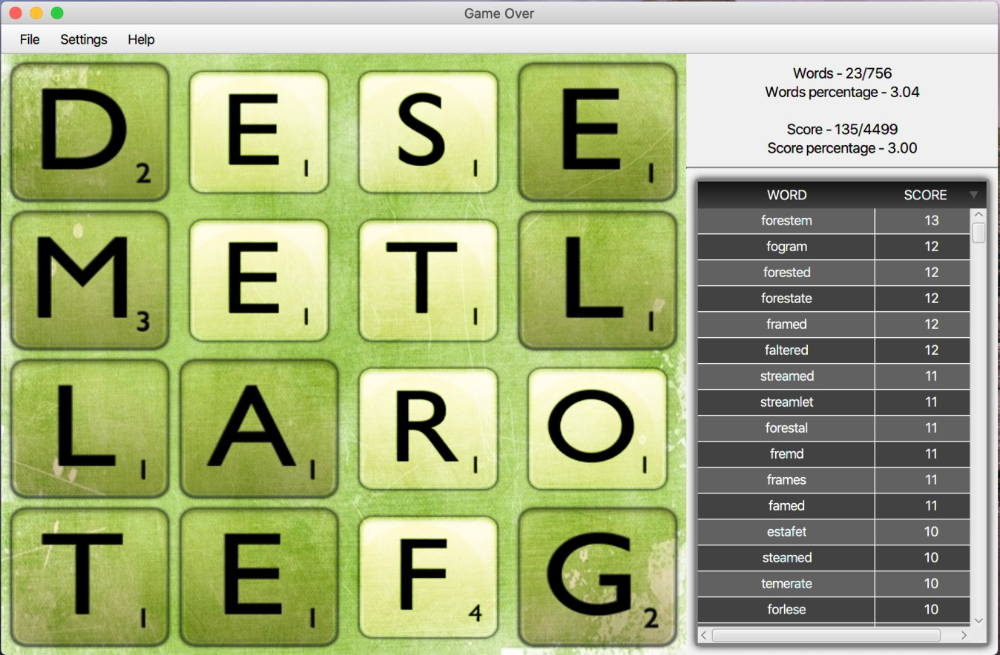
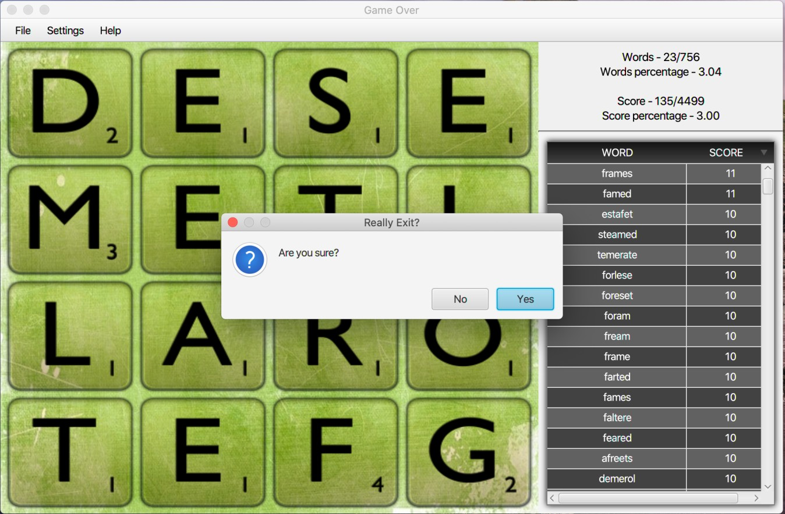

---

<div>Theme images picked from <a href="https://unsplash.com" target="_blank">Unsplash</a>.</div>
